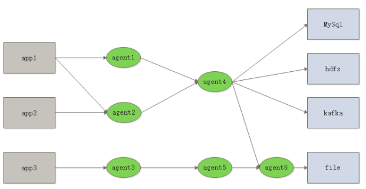

## 一. flume的框架





flume的核心是agent，而agent包含source、channel、sink三个组件。

- source：source组件是专门用来收集数据的，可以处理各种类型、各种格式的日志数据,包括avro、thrift、exec、jms、spooling directory、netcat、sequence generator、syslog、http、legacy、自定义。

- channel：source组件把数据收集来以后，临时存放在channel中，即channel组件在agent中是专门用来存放临时数据的——对采集到的数据进行简单的缓存，可以存放在memory、jdbc、file等等。

- sink：sink组件是用于把数据发送到目的地的组件，目的地包括hdfs、logger、avro、thrift、ipc、file、null、hbase、solr、自定义

**工作流程**：flume把数据从数据源(source)收集过来，再将数据送到指定的目的地(sink)。为保证传输的过程一定成功，在送到目的地(sink)之前，会先缓存数据(channel),待数据真正到达目的地(sink)后，flume再删除自己缓存的数据。 在整个数据的传输的过程中，流动的是event（基本单位），因此事务保证是在event级别进行的。

**event**：event将传输的数据进行封装，是flume传输数据的基本单位，如果是文本文件，通常是一行记录。event也是事务的基本单位。event在单个agent中经历source—channel—sink过程，后面可能输出到下一个agent或者flume外的系统中。event本身为一个字节数组，其携带headers(头信息)信息，消息体，消息内容

从上面图中可以看出flume支持多级的成网状数据流动，非常的灵活好用，这应该就是flume广泛使用原因吧。比如数据扇入到同一个agent或者扇出到多个agent。

## 二. 配置文件

以项目“从0开始搭建推荐系统”为例：

```markdown
编辑：`/root/bigdata/flume/conf/click_trace_log_hdfs.properties`
​```
# Name the components on this agent
a1.sources = r1
a1.sinks = k1 k2
a1.channels = c1

# Describe/configure the source
a1.sources.r1.type = exec
a1.sources.r1.command = tail -F /root/workspace/3.rs_project/project2/meiduoSourceCode/logs/click_trace.log
a1.sources.r1.channels = c1

a1.sources.r1.interceptors = t1
a1.sources.r1.interceptors.t1.type = timestamp

# Use a channel which buffers events in memory
a1.channels.c1.type = memory
a1.channels.c1.capacity = 1000
a1.channels.c1.transactionCapacity = 100

a1.sinks.k1.type = hdfs
a1.sinks.k1.channel = c1
a1.sinks.k1.hdfs.path = hdfs://localhost:9000/meiduo_mall/logs/click-trace/%y-%m-%d
as.sinks.k1.hdfs.userLocalTimeStamp = true
a1.sinks.k1.hdfs.filePrefix = click-trace-
a1.sinks.k1.hdfs.fileType = DataStream
a1.sinks.k1.hdfs.writeFormat = Text
a1.sinks.k1.hdfs.round = true
a1.sinks.k1.hdfs.roundValue = 10
a1.sinks.k1.hdfs.roundUnit = minute

a1.sinks.k2.channel = c1
a1.sinks.k2.type = org.apache.flume.sink.kafka.KafkaSink
a1.sinks.k2.kafka.topic = meiduo_click_trace
a1.sinks.k2.kafka.bootstrap.servers = localhost:9092
a1.sinks.k2.kafka.flumeBatchSize = 20
a1.sinks.k2.kafka.producer.acks = 1
a1.sinks.k2.kafka.producer.linger.ms = 1
a1.sinks.k2.kafka.producer.compression.type = snappy
​```

启动flume对点击流日志进行采集，分别发送到kafka和hdfs：`flume-ng agent -f /root/bigdata/flume/conf/click_trace_log_hdfs.properties -n a1`
```


