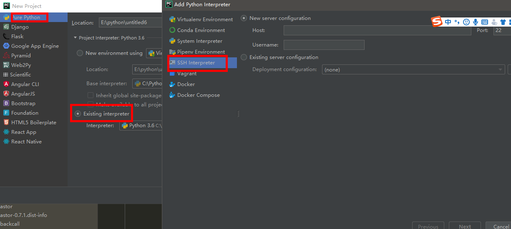
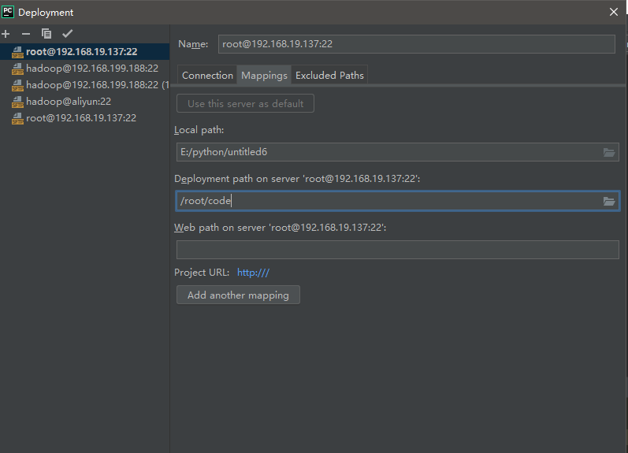
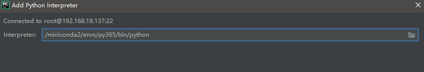
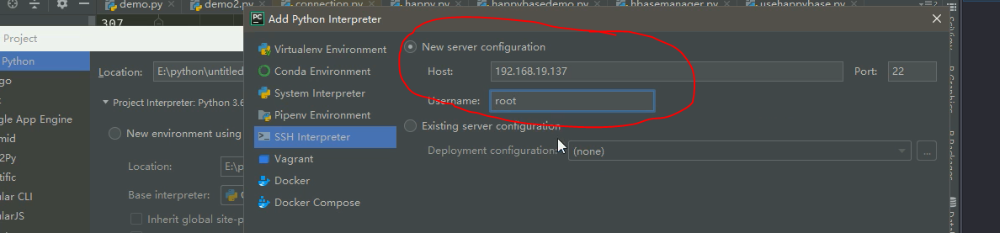
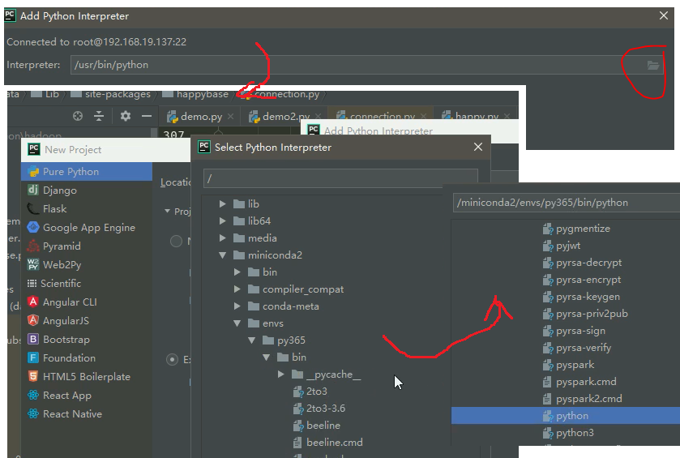
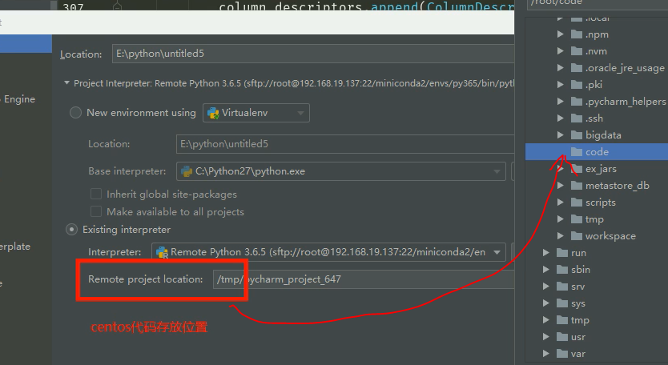
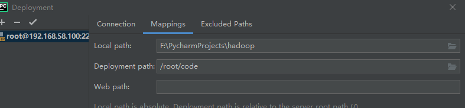
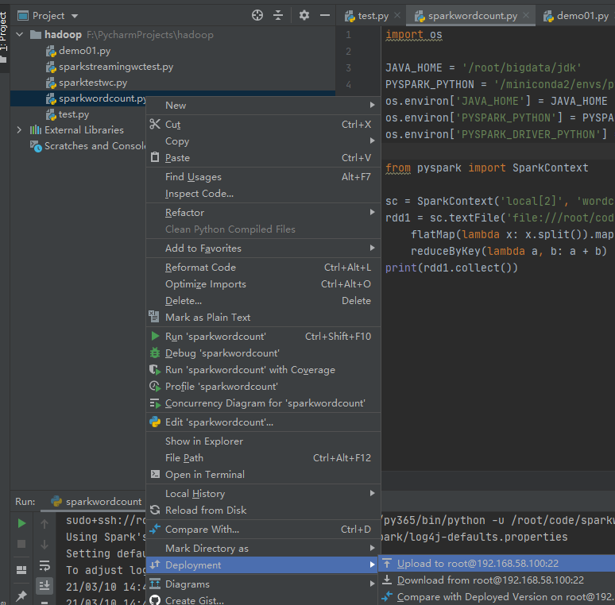

## spark-core 实战案例

课程目标：

- 独立实现Spark RDD的word count案例
- 独立实现spark RDD的PV UV统计案例

### 4.0 Pycharm编写spark代码环境配置

准备pycharm环境

* 新建python项目同时进行如下步骤：













* 本机的deployment路径映射：tools->deployment->接下来如图：



* 建立部署映射后，就可以将 window本地项目 与 远程环境里的项目 相互同步了，同步就是本地与远程文件彼此上传、下载。同步步骤如下：



### 4.1利用PyCharm编写spark wordcount程序

- 环境配置

  ```PYTHON
  JAVA_HOME = '/root/bigdata/jdk'
  PYSPARK_PYTHON = '/miniconda2/envs/py365/bin/python'
  os.environ['JAVA_HOME'] = JAVA_HOME
  os.environ['PYSPARK_PYTHON'] = PYSPARK_PYTHON
  os.environ['PYSPARK_DRIVER_PYTHON'] = PYSPARK_PYTHON
  
  ```

- 代码

```PYTHON
import os

JAVA_HOME = '/root/bigdata/jdk'
PYSPARK_PYTHON = '/miniconda2/envs/py365/bin/python'
os.environ['JAVA_HOME'] = JAVA_HOME
os.environ['PYSPARK_PYTHON'] = PYSPARK_PYTHON
os.environ['PYSPARK_DRIVER_PYTHON'] = PYSPARK_PYTHON

from pyspark import SparkContext

sc = SparkContext('local[2]', 'wordcount')
rdd1 = sc.textFile('file:///root/code/test.txt'). \
    flatMap(lambda x: x.split()).map(lambda x: (x, 1)). \
    reduceByKey(lambda a, b: a + b)
print(rdd1.collect())
```


```python
import sys


from pyspark.sql import SparkSession

if __name__ == '__main__':

    if len(sys.argv) != 2:
        print("Usage: avg <input>", file=sys.stderr)
        sys.exit(-1)

    spark = SparkSession.builder.appName("test").getOrCreate()
	sc = spark.sparkContext

    counts = sc.textFile(sys.argv[1]) \
            .flatMap(lambda line: line.split(" ")) \
            .map(lambda x: (x, 1)) \
            .reduceByKey(lambda a, b: a + b)

    output = counts.collect()

    for (word, count) in output:
    	print("%s: %i" % (word, count))

    sc.stop()
```

- 将代码上传到远程cent-os系统上

- 在系统上执行指令

  `spark-submit --master local wc.py file:///root/bigdata/data/spark_test.log`

### 4.2 通过spark实现点击流日志分析

在新闻类网站中，经常要衡量一条网络新闻的页面访问量，最常见的就是uv和pv，如果在所有新闻中找到访问最多的前几条新闻，topN是最常见的指标。

- 数据示例

```shell
#每条数据代表一次访问记录 包含了ip 访问时间 访问的请求方式 访问的地址...信息
194.237.142.21 - - [18/Sep/2013:06:49:18 +0000] "GET /wp-content/uploads/2013/07/rstudio-git3.png HTTP/1.1" 304 0 "-" "Mozilla/4.0 (compatible;)"
183.49.46.228 - - [18/Sep/2013:06:49:23 +0000] "-" 400 0 "-" "-"
163.177.71.12 - - [18/Sep/2013:06:49:33 +0000] "HEAD / HTTP/1.1" 200 20 "-" "DNSPod-Monitor/1.0"
163.177.71.12 - - [18/Sep/2013:06:49:36 +0000] "HEAD / HTTP/1.1" 200 20 "-" "DNSPod-Monitor/1.0"
101.226.68.137 - - [18/Sep/2013:06:49:42 +0000] "HEAD / HTTP/1.1" 200 20 "-" "DNSPod-Monitor/1.0"
101.226.68.137 - - [18/Sep/2013:06:49:45 +0000] "HEAD / HTTP/1.1" 200 20 "-" "DNSPod-Monitor/1.0"
60.208.6.156 - - [18/Sep/2013:06:49:48 +0000] "GET /wp-content/uploads/2013/07/rcassandra.png HTTP/1.0" 200 185524 "http://cos.name/category/software/packages/" "Mozilla/5.0 (Windows NT 6.1) AppleWebKit/537.36 (KHTML, like Gecko) Chrome/29.0.1547.66 Safari/537.36"
222.68.172.190 - - [18/Sep/2013:06:49:57 +0000] "GET /images/my.jpg HTTP/1.1" 200 19939 "http://www.angularjs.cn/A00n" "Mozilla/5.0 (Windows NT 6.1) AppleWebKit/537.36 (KHTML, like Gecko) Chrome/29.0.1547.66 Safari/537.36"
222.68.172.190 - - [18/Sep/2013:06:50:08 +0000] "-" 400 0 "-" "-"
```

- 访问的pv

  pv：网站的总访问量

  ```python
  from pyspark.sql import SparkSession
  
  spark = SparkSession.builder.appName("pv").getOrCreate()
  sc = spark.sparkContext
  rdd1 = sc.textFile("file:///root/bigdata/data/access.log")
  #把每一行数据记为("pv",1)
  rdd2 = rdd1.map(lambda x:("pv",1)).reduceByKey(lambda a,b:a+b)
  rdd2.collect()
  sc.stop()
  ```

- 访问的uv

  uv：网站的独立用户访问量

  ```python
  from pyspark.sql import SparkSession
  
  spark = SparkSession.builder.appName("pv").getOrCreate()
  sc = spark.sparkContext
  rdd1 = sc.textFile("file:///root/bigdata/data/access.log")
  #对每一行按照空格拆分，将ip地址取出
  rdd2 = rdd1.map(lambda x:x.split(" ")).map(lambda x:x[0])
  #把每个ur记为1
  rdd3 = rdd2.distinct().map(lambda x:("uv",1))
  rdd4 = rdd3.reduceByKey(lambda a,b:a+b)
  rdd4.saveAsTextFile("hdfs:///uv/result")
  sc.stop()
  ```

- 访问的topN

  ```python
  from pyspark.sql import SparkSession
  
  spark = SparkSession.builder.appName("topN").getOrCreate()
  sc = spark.sparkContext
  rdd1 = sc.textFile("file:///root/bigdata/data/access.log")
  #对每一行按照空格拆分，将url数据取出，把每个url记为1
  rdd2 = rdd1.map(lambda x:x.split(" ")).filter(lambda x:len(x)>10).map(lambda x:(x[10],1))
  #对数据进行累加，按照url出现次数的降序排列
  rdd3 = rdd2.reduceByKey(lambda a,b:a+b).sortBy(lambda x:x[1],ascending=False)
  #取出序列数据中的前n个
  rdd4 = rdd3.take(5)
  rdd4.collect()
  sc.stop()
  ```

